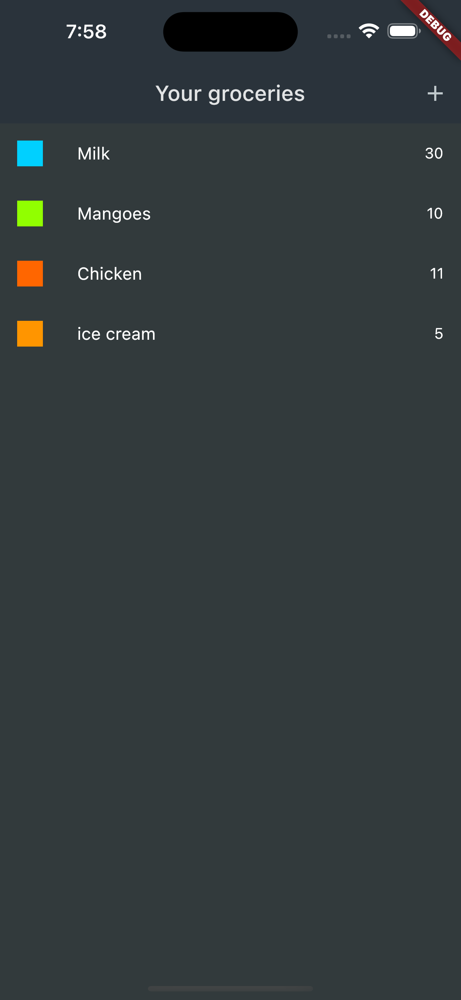
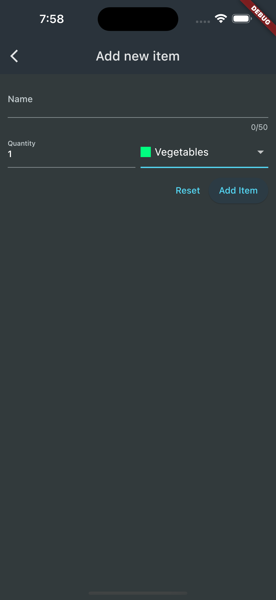
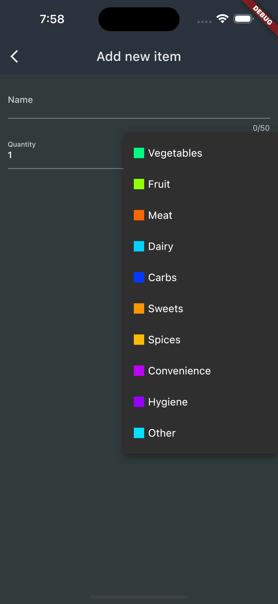
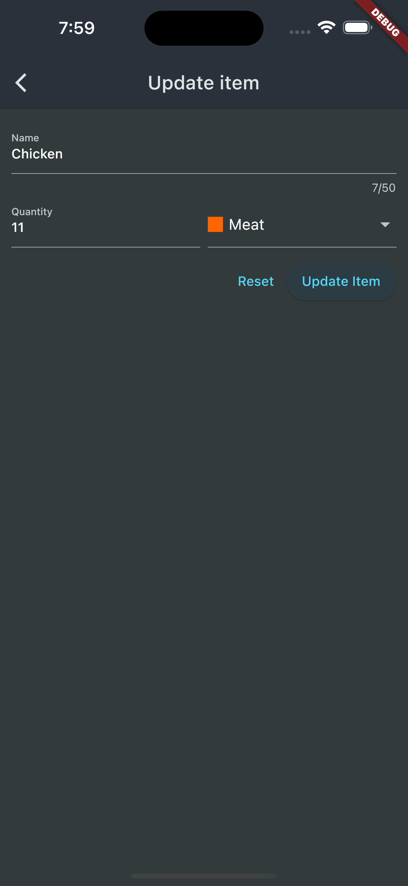

# Flutter shopping list

This is a simple flutter app to show/add/edit/delete shopping lists. This app is integrated with firebase.

For security reasons, .env is used to save the firebase url. Create a .env file at the project root level and set FIREBASE_URL value in that. For example, for this project the content of .env looks like this:

```
FIREBASE_URL=some-dummy-url-default-rtdb.firebaseio.com
```


### Screenshots

#### Shopping items
<p align="center">

<br/></p>

#### Add new item
<p align="center">

<br/></p>

#### Add new item with open dropdown
<p align="center">

<br/></p>

#### Edit an existing item
<p align="center">

<br/></p>